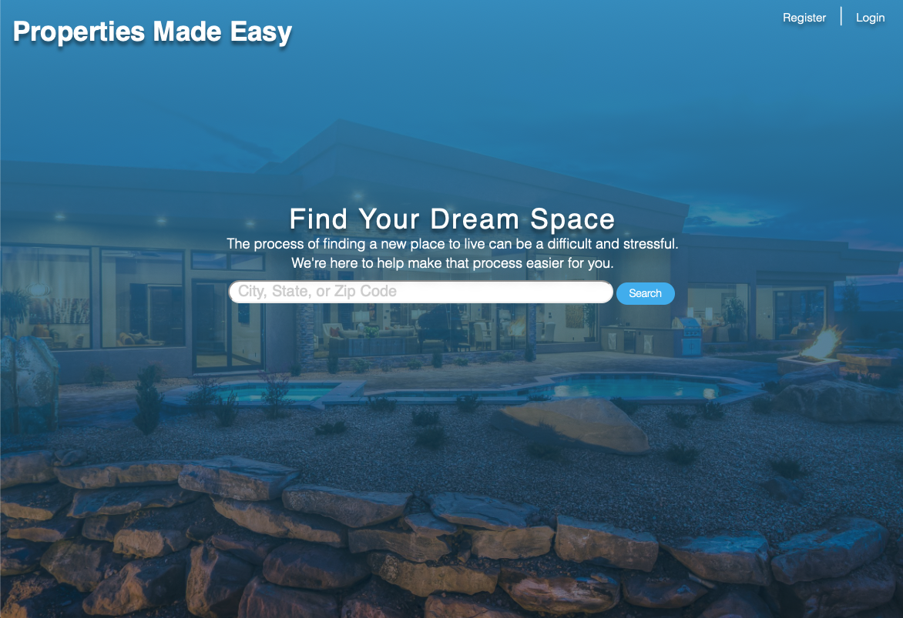
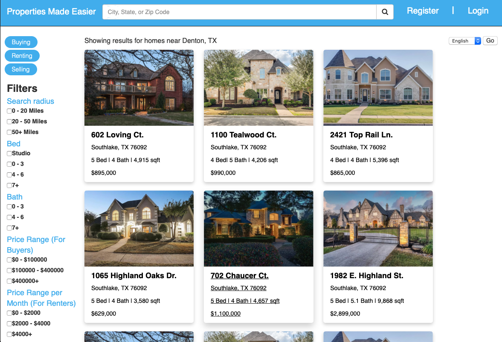
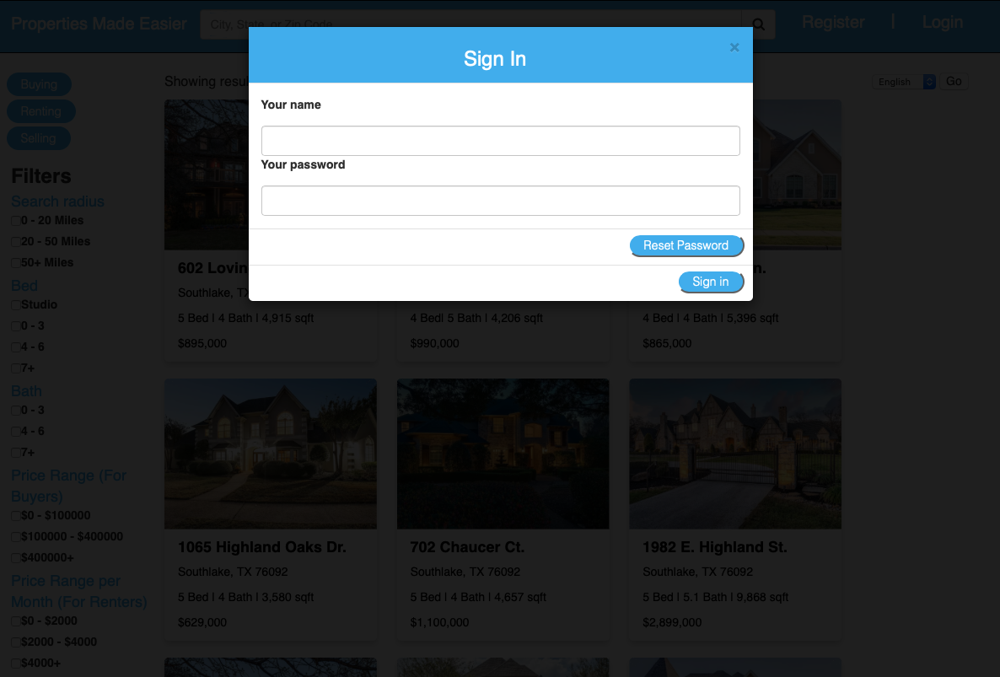
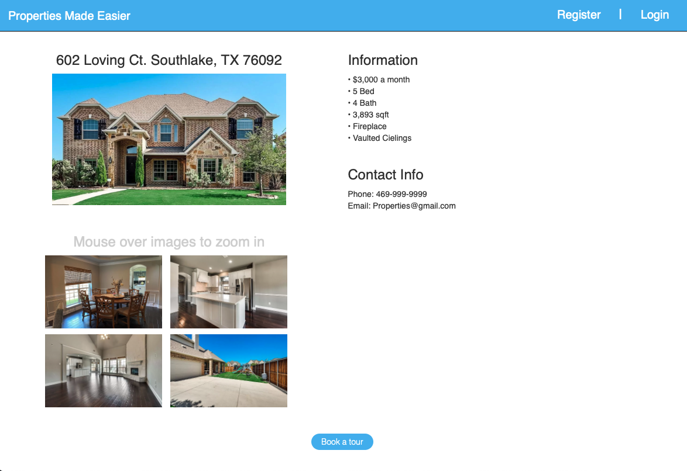

# Real Estate Web UI
A UI for a real estate applcation. 
 
## Table of contents
* [General info](#general-info)
* [Technologies](#technologies)
* [Access](#access)
* [Screenshots](#screenshots)
* [Takeaways](#takeaways)
 
## General Info 
This project was created as part of a group project for a human web interfaces course. The UI was built for a real estate web application using the ASP.NET framework as chosen by a member of the group. My role in the group was to design the web app and translate those designs into code while the others would work on presenting my design to a 'client'. 

## Technologies 
This application was created with: 
* HTML/CSS/Javascript
* C#
* ASP.NET Web Framework 
* Azure

## Access 
UI can be accessed at https://uirealestateapp.azurewebsites.net/landingpage 

## Screenshots
 
 

## Takeaways
This application was a great oppurtunity to get better with frontend web development. Throughout the course of the project I was able to get better at the following: 
* Designing a UI
* Practice with translating designs and mockups to code
* Working together with a group while being the main designer/frontend developer
* HTML/CSS/Javascript
* A little bit of ASP.NET and C#
* Hosting an ASP.NET web application with AZURE
